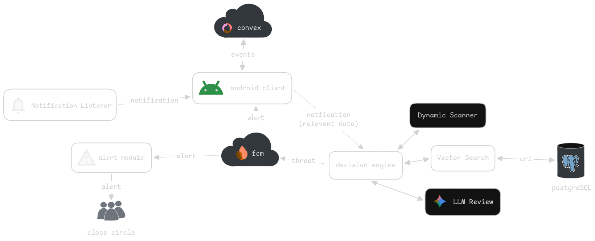

# NoPhish


NoPhish is an Android security app for detecting phishing attempts in push notifications. It captures risky notification surfaces on-device, sends them to the NoPhish backend for analysis, records suspicious events, and gives a trusted family circle a way to review and respond.

Backend: [lordYorden/NoPhish-server](https://github.com/lordYorden/NoPhish-server)

## What It Does

- Monitors notification content through Android notification listener access.
- Uploads captured notification payloads through a foreground service.
- Authenticates users with Clerk.
- Stores member, circle, invite-code, event, and temporary block state in Convex.
- Shows attack history, circle alerts, recent activity, and technical event details.
- Sends malicious-event alerts through Firebase Cloud Messaging.
- Lets circle members temporarily block and release the source app for a suspicious event.
- Stores pending uploads and malicious-notification details in encrypted local DataStore.


## Book-to-Code Highlights

1. **Capture and filter incoming notifications** — the [notification listener](https://github.com/lordYorden/nophish-android/blob/main/app/src/main/java/dev/lordyorden/as_no_phish_detector/services/NotificationReceiverService.kt#L22) ignores NoPhish and system notifications, extracts the title, body, timestamp, source package, and URLs, then forwards eligible notifications for analysis.
2. **Prepare and send a privacy-controlled analysis payload** — the [foreground service](https://github.com/lordYorden/nophish-android/blob/main/app/src/main/java/dev/lordyorden/as_no_phish_detector/services/UploadForegroundService.kt#L114) creates the notification payload, associates it with the signed-in user and their circle, and queues a failed upload for retry. The user-controlled [security-analysis toggle](https://github.com/lordYorden/nophish-android/blob/main/app/src/main/java/dev/lordyorden/as_no_phish_detector/ui/settings/SettingsFragment.kt#L56) supplies `allowExternalAnalysis`, which the [upload request includes](https://github.com/lordYorden/nophish-android/blob/main/app/src/main/java/dev/lordyorden/as_no_phish_detector/services/UploadForegroundService.kt#L219).
3. **Create a trusted close circle** — the [Android client](https://github.com/lordYorden/nophish-android/blob/main/app/src/main/java/dev/lordyorden/as_no_phish_detector/ui/CircleCreationFragment.kt#L48) calls the Convex [`circles:create` mutation](https://github.com/lordYorden/nophish-android/blob/main/convex/circles.ts#L7), then calls [`otps:issue`](https://github.com/lordYorden/nophish-android/blob/main/convex/otps.ts#L7) to create an invite code for trusted family members or friends.
4. **Receive verified threat alerts** — the [FCM service](https://github.com/lordYorden/nophish-android/blob/main/app/src/main/java/dev/lordyorden/as_no_phish_detector/services/FCMService.kt#L23) parses a malicious-event payload, verifies its integrity hash, displays the threat notification, and records the event locally.
5. **Temporarily block a risky source app** — a circle member uses the [Android block action](https://github.com/lordYorden/nophish-android/blob/main/app/src/main/java/dev/lordyorden/as_no_phish_detector/ui/events/CircleEventsViewModel.kt#L95) to call the Convex [`blocks:blockFromEvent` and `blocks:releaseForEvent` mutations](https://github.com/lordYorden/nophish-android/blob/main/convex/blocks.ts#L5); the target device [subscribes](https://github.com/lordYorden/nophish-android/blob/main/app/src/main/java/dev/lordyorden/as_no_phish_detector/services/AppBlockAccessibilityService.kt#L56) to [`blocks:getActiveForApp`](https://github.com/lordYorden/nophish-android/blob/main/convex/blocks.ts#L106) and presents the block screen when that package opens.

## Architecture



```text
Android receivers/services
  NotificationReceiverService
  UploadForegroundService
  FCMService
  AppBlockAccessibilityService

Application state
  Clerk auth
  Convex client
  CircleMembersRepository
  ViewModels
  Encrypted DataStore

Remote systems
  NoPhish REST API
  Convex
  Firebase Cloud Messaging
```

The app has two main activity hosts:

- `MainActivity` handles the launch and onboarding flow.
- `ClientActivity` hosts the signed-in client experience.

### Project Layout

```text
app/src/main/java/dev/lordyorden/as_no_phish_detector/
  services/        Android background, receiver, FCM, and blocking services
  ui/              Fragments, renderers, adapters, and view models
  repositories/    Shared data repositories
  retrofit/        REST API controllers
  utilities/       Convex, notification, network, parser, and storage helpers

convex/
  schema.ts        Convex tables and indexes
  members.ts       Member mutations and queries
  circles.ts       Circle mutations and queries
  events.ts        Malicious-event mutations and queries
  otps.ts          Invite-code issue and redeem flow
  blocks.ts        Temporary app-block mutations and queries
```

## Tech Stack

- Kotlin and Android XML views
- AndroidX Navigation, Lifecycle, WorkManager, and DataStore
- Material Components
- Retrofit, Gson, and ViewBinding
- Clerk Android SDK
- Convex Android client
- Firebase Analytics and Firebase Messaging
- Tink-backed encrypted DataStore
- Protocol Buffers Kotlin lite

## Requirements

- Android Studio
- JDK 21
- Android SDK 36
- Android device or emulator running API 26+
- `app/google-services.json` for Firebase
- A reachable NoPhish REST backend
- Access to the Clerk and Convex projects configured in this repository

## Configuration

The REST backend URL is provided to the Android app through the `REST_API_BASE_URL` Gradle property. The value is compiled into `BuildConfig.REST_API_BASE_URL` and read by `Constants.RestAPI.BASE_URL`.

Add it to `local.properties` for local development:

```properties
REST_API_BASE_URL=https://your-api.example.com
```

Or pass it on the command line:

```bash
./gradlew assembleDebug -PREST_API_BASE_URL=https://your-api.example.com
```

If the property is not set, the Gradle build currently uses `https://localhost:9000`. The resolved value must not be blank.

For physical-device testing against a backend running on your development machine, use `adb reverse` so the Android device can reach the host machine over the USB debug connection. Android documents `adb` in the [Android Debug Bridge docs](https://developer.android.com/tools/adb).

```bash
adb reverse tcp:9000 tcp:9000
```

```properties
REST_API_BASE_URL=https://localhost:9000
```

For a self-hosted backend that should be reachable outside a USB-connected development session, publish it inside your tailnet with Tailscale. See the [Tailscale Services docs](https://tailscale.com/docs/features/tailscale-services).

Project-specific service configuration currently lives in code:

- Clerk publishable key: `app/src/main/java/dev/lordyorden/as_no_phish_detector/App.kt`
- Convex deployment URL: `app/src/main/java/dev/lordyorden/as_no_phish_detector/utilities/ConvexHelper.kt`
- Convex auth provider: `convex/auth.config.ts`

For setting up a new Convex deployment, start with the [Convex docs](https://docs.convex.dev/home). For the Clerk integration used by this app, see the [Convex Clerk auth guide](https://docs.convex.dev/auth/clerk).

## Build

Build the debug APK:

```bash
./gradlew assembleDebug
```

Install on a connected device:

```bash
./gradlew installDebug
```

Run checks available through Gradle:

```bash
./gradlew check
```

## Data Flow

1. The user signs in with Clerk.
2. The app initializes a Clerk-authenticated Convex client.
3. The user creates or joins a trusted circle.
4. Notification content is captured by Android services.
5. `UploadForegroundService` sends captured notification payloads to the REST backend.
6. Malicious events are registered in Convex.
7. History, circle alerts, and recent activity read event state from Convex.
8. FCM delivers alert payloads to circle members.
9. Circle members can temporarily block or release the source app.

## Troubleshooting

- Notification capture requires enabling NoPhish under Android notification listener settings.
- Temporary app blocking requires enabling the NoPhish accessibility service.
- Upload failures usually mean the device cannot reach `REST_API_BASE_URL`.
- Authentication and circle failures usually point to Clerk or Convex configuration.
- FCM delivery issues usually point to `app/google-services.json`, Firebase setup, or topic subscription failures.
